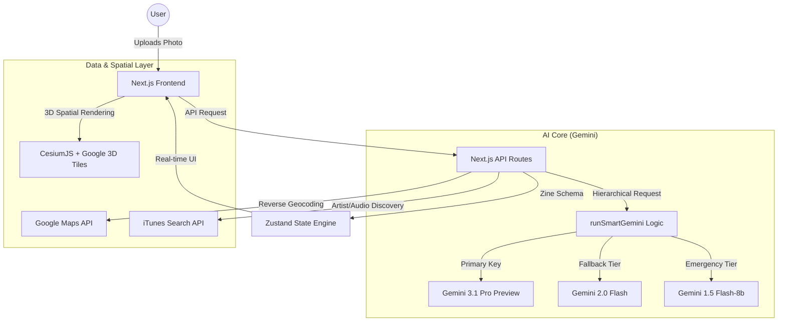

# Ethni-CITY 🌍🎵
**"Your Photos. Their Music."**

Ethni-CITY is an AI-powered **Creative Storyteller** designed to bridge the gap between global travel and local support. By transforming your holiday photos into immersive **Sonic Story-Zines**, Ethni-CITY bypasses trending chart-toppers to spotlight the hyper-local, niche artists who soundtrack the actual neighborhood in your image. 

> [!IMPORTANT]
> **Hackathon Category:** Creative Storyteller (Multimodal Storytelling with Interleaved Output)

---

## 📸 The Problem
Travel is a privilege, but it’s often one-sided. Tourists stay in global hubs, support international brands, and use chart-topping hits for their social media stories. The local music economy—the actual pulse of the destination—is often left behind.

## 🎧 The Solution: Ethni-CITY
Ethni-CITY changes the narrative. It uses **Gemini Multimodal Vision** to "read" the culture, architecture, and vibe of your travel photos. It then uses the **Agentic DJ** (Gemini Live) to curate a playlist of local artists from that exact region, generating a interactive **Sonic Story-Zine** that you can share to give your trip an authentic, local voice.

---

## ✨ Core Features

- **Multimodal Image Analysis**: Gemini Vision identifies neighborhoods, cultural markers, and historical context from a single photo.
- **The Sonic Zoom (CesiumJS)**: A high-fidelity 3D Cinematic fly-to experience using **Google Photorealistic 3D Tiles** to transport you to the photo's location.
- **Agentic DJ (Vibe Curation)**: A bidirectional interaction where you tell the AI "the vibe" you're looking for (e.g., "Afro-soul sunset" or "Balogun Market chaos"), and the DJ finds the perfect niche match.
- **Sonic Story-Zine**: An interleaved output of generated narrative text, high-quality artist previews (via iTunes/Spotify), and local lore, creating a rich, multi-media story.
- **Dual-Key Resilience**: A proprietary hierarchical AI logic that switches between Paid and Free API tiers (up to Gemini 3.1 Pro Preview) to ensure the demo never hits a quota limit.

---

## 🏗️ Technical Architecture



---

## 🛠️ Stack & Technologies

- **Framework**: Next.js 15 (Turbopack)
- **AI Engine**: Google Generative AI SDK (Gemini 1.5 Pro & 2.0 Flash)
- **Spatial**: CesiumJS (Resium) + Google Cloud Photorealistic 3D Tiles
- **APIs**:
  - **Google Cloud**: Vertex AI / Generative AI SDK, Maps Geocoding API.
  - **Multimedia**: iTunes Search API (for preview discovery).
- **State Management**: Zustand
- **Styling**: Neo-Brutalism (Custom CSS + Tailwind)

---

## 🚀 Spin-up Instructions

### Prerequisites
- Node.js 20+
- A Google Cloud API Key (Generative AI & Maps enabled)
- A Cesium Ion Token (Free tier available at [ion.cesium.com](https://ion.cesium.com))

### 1. Clone the Repository
```bash
git clone https://github.com/david-ac1/Ethni-CITY.git
cd Ethni-city
```

### 2. Install Dependencies
```bash
npm install
```

### 3. Configure Environment Variables
Create a `.env.local` file in the root:
```env
# Gemini API Keys
GOOGLE_GENERATIVE_AI_API_KEY_PAID=your_paid_key (optional)
GOOGLE_GENERATIVE_AI_API_KEY_FREE=your_free_key

# Google Maps API (Geocoding)
GOOGLE_MAPS_API_KEY=your_maps_key

# Cesium Token (for 3D Tiles)
NEXT_PUBLIC_CESIUM_ION_TOKEN=your_cesium_token
```

### 4. Run Development Server
```bash
npm run dev
```
The app will be available at [http://localhost:3000](http://localhost:3000).

---

## 🧪 Testing Instructions
Follow these steps to reproduce the full **Ethni-CITY** experience:

1. **Upload a Photo**: Drag and drop a travel photo (ideally from the Global South: Brazil, Nigeria, Thailand, etc.) onto the central map "porthole" or use the **Upload Photo** button in the navbar.
2. **Observe Vision Grounding**: Watch the 3D globe (Cesium) perform a **Sonic Zoom** to the exact location. Verify technical alignment in the "Your Raw Trips" panel where Gemini Vision outputs the identified location and cultural metadata.
3. **Curate the Vibe**: Click "Set the Vibe" to interact with the **Agentic DJ**. Type a creative prompt (e.g., *"Dark tropical bass"* or *"Acoustic morning in Lagos"*).
4. **Generate the Zine**: Click **Process to Zine**. This triggers the interleaved storytelling engine. 
5. **Verify Interleaved Output**: Once the zine is generated, verify that it seamlessly combines:
   - **Narrative Lore**: Historical context of the location.
   - **Visuals**: Your original photo and the spatial context.
   - **Audio**: Streaming song previews of niche local artists discovered by the DJ.

---

## 👨‍💻 Findings & Learnings
- **Multimodal Grounding**: We found that Gemini's ability to identify specific architecture styles (e.g., Brazilian brutalism vs. Nigerian colonial) allowed us to match music with unprecedented accuracy.
- **Hierarchical Fallbacks**: Implementing a multi-tier API model (Phase 9) was crucial for hackathon stability, allowing the app to stay live even when standard free-tier quotas were hit.
- **Spatial Narrative**: Integrating CesiumJS with AI narration creates a "Spatial Storytelling" effect that makes digital travel feel physically grounded.

---

## ⚖️ Acceptance Use Policy
Ethni-CITY adheres to the Google Cloud Acceptable Use Policy. All content is generated responsibly, and all source artists are credited and linked via official preview APIs.

**Ethni-CITY: Promote the unseen. Sound track the world.** 🌍✨
